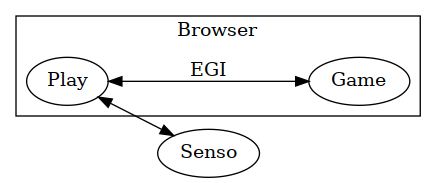
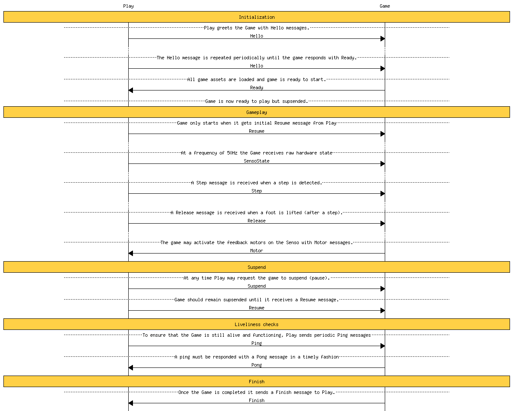

# ![Play\[dev\]](images/logo-play-dev.png)

[Dividat Play](https://dividat.com/en/senso) is a web-based environment for playing games with the [Dividat Senso](https://dividat.com/en/senso) hardware. It is capable of loading and running "external" games (that is games that are not developed in the same codebase). This repository contains documentations and examples on how to develop games for usage with Dividat Play and Senso.

## Overview

-   **Play**: Dividat Play is a web application that loads games according to personal training plans and manages hardware connectiviy.
-   **Game**: The game you are developing can be developed in any language or framework that can target the Web platform (e.g. [Unity](https://unity3d.com/), [Phaser](https://phaser.io/), [ClojureScript](https://clojurescript.org/)). The game connects to Play via a protocol called the _External Game Interface_ (EGI).
-   **Senso**: Used as controller for the games. Play connects to the Dividat Senso and acts as a proxy between the hardware and your game.

## EGI

The Game communicates to Play via a message based protocol. Play sends messages to your game and your game sends messages to Play.

To use the EGI a small JavaScript library must be loaded which is available at <https://play.dividat.com/PlayEGI.js>. A [description of the library](types/) is available as a TypeScript declaration.

### Under the hood

The game is loaded by Play in an [`iframe`](https://developer.mozilla.org/en-US/docs/Web/HTML/Element/iframe). EGI messages are sent with the [`Window.postMessage()`](https://developer.mozilla.org/en-US/docs/Web/API/Window/postMessage) method.

## Senso signal

The Senso signal consists of a series of `x`, `y` and `f` measurements for each of the plates. The `x` and `y` values describe a position on the Senso's surface with `(0, 0)` in the upper left and `(3, 3)` in the lower right corner. The `f` value describes the "force" as a number between 0 and 1, where 1 is the maximum force the sensors can theoretically measure.

## Development tool

A development tool that implements the EGI is available at <https://play.dividat.com/playDev.html>.

### Use without Senso

The PlayDev environment, like the actual Play application, does not forward arbitrary keyboard events when running games. Specific keys are translated and forwarded as Senso inputs:

- The arrow keys for the outer plates
- The space key for the center plate

Keydown and keyup events are sent as `Step` and `Release` events, respectively.

## [Examples](examples)

Examples are provided to illustrate developement of Games for Play:

- [`hello-clojure`](examples/hello-clojure): A simple ClojureScript app illustrating usage of EGI.

TODO: More examples.

